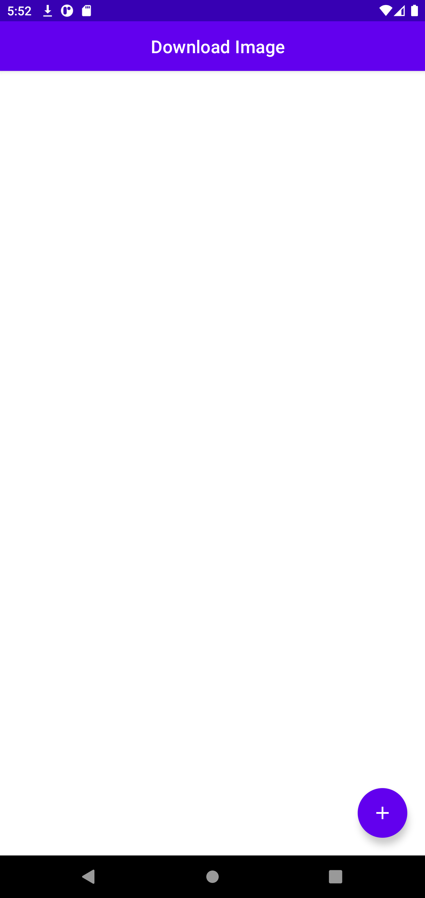
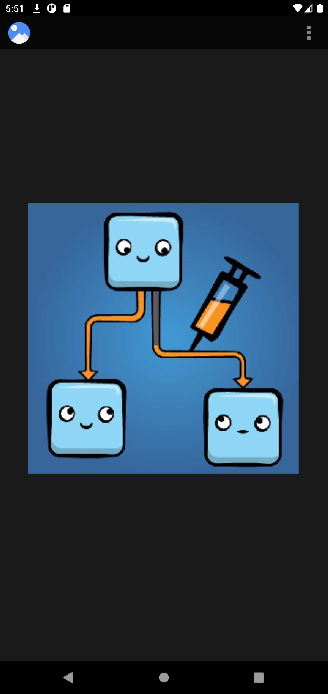

# Download Image

It downloads the image from a URL and makes it available for the user to view in an image reader of his choice (if there is more than one).

## Features

* Jetpack Compose
* Clean Architecture with MVVM
* Dagger Hilt

## Prerequisite

To build this project, you require:

* Android Studio Electric Eel
* Gradle 7.5
* Kotlin 1.7.20
* Android Gradle Plugin 7.4.0

## Screenshots

<h4 align="center">

<br>

## Libraries

| Library | Description | Version |
|--|--|--|
| [Compose UI](https://developer.android.com/jetpack/androidx/releases/compose-ui) | Fundamental components of compose UI needed to interact with the device, including layout, drawing, and input | 1.3.3 |
| [Compose Compiler](https://developer.android.com/jetpack/androidx/releases/compose-compiler) | Transform @Composable functions and enable optimizations with a Kotlin compiler plugin | 1.3.2 |
| [Dagger Hilt](https://dagger.dev/hilt) | Handles dependency injection | 2.44 |
| [Hilt Navigation Compose](https://developer.android.com/jetpack/androidx/releases/hilt) | Extend the functionality of Dagger Hilt to enable dependency injection of certain classes from the androidx libraries (hiltViewModel) | 1.0.0 |
| [Compose Runtime LiveData](https://developer.android.com/jetpack/androidx/releases/compose-runtime) | Added ui-livedata - new artifact with an adapter for LiveData. Example of the usage: val value by liveData.observeAsState() | 1.3.3 |
| [ViewModel](https://developer.android.com/topic/libraries/architecture/viewmodel) | Presenter for persisting view state across config changes | |
| [MutableLiveData](https://developer.android.com/reference/kotlin/androidx/lifecycle/MutableLiveData) | LiveData which publicly exposes setValue and postValue method | |
| [LiveData](https://developer.android.com/topic/libraries/architecture/livedata) | Is considers an observer, which is represented by the Observer class, to be in an active state if its lifecycle is in the STARTED or RESUMED state. LiveData only notifies active observers about updates | |

## License

```license
Copyright 2022-2023 Luiz Campos

Licensed under the Apache License, Version 2.0 (the "License");
you may not use this file except in compliance with the License.
You may obtain a copy of the License at

    http://www.apache.org/licenses/LICENSE-2.0

Unless required by applicable law or agreed to in writing, software
distributed under the License is distributed on an "AS IS" BASIS,
WITHOUT WARRANTIES OR CONDITIONS OF ANY KIND, either express or implied.
See the License for the specific language governing permissions and
limitations under the License.
```
